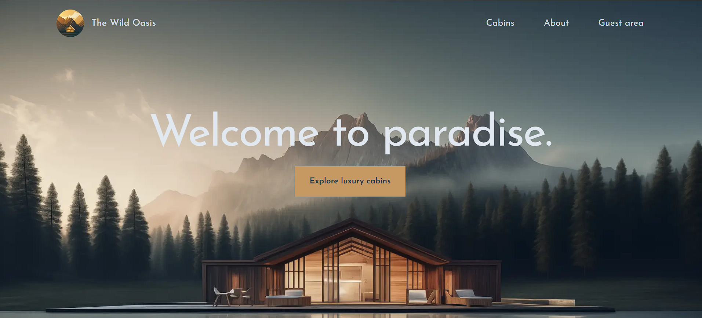
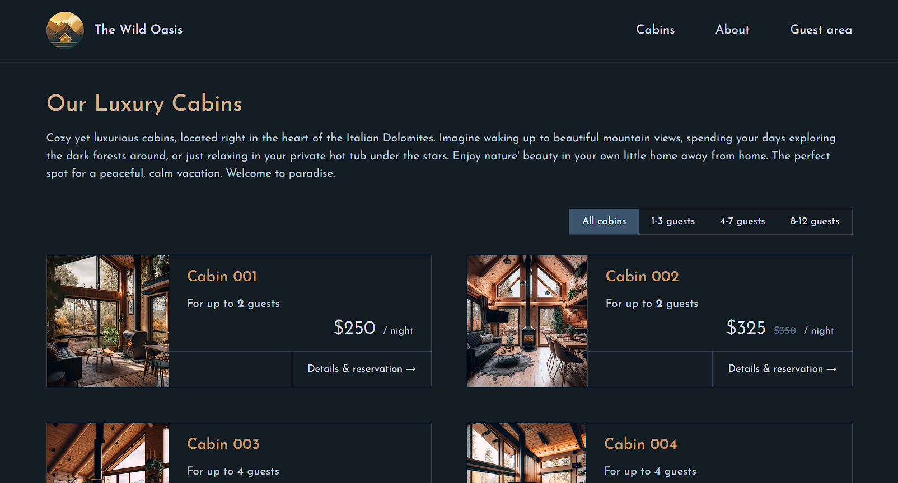
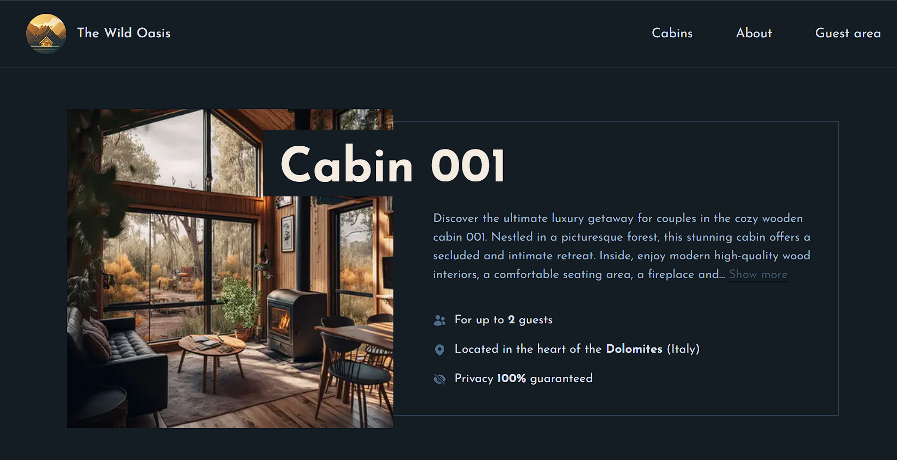
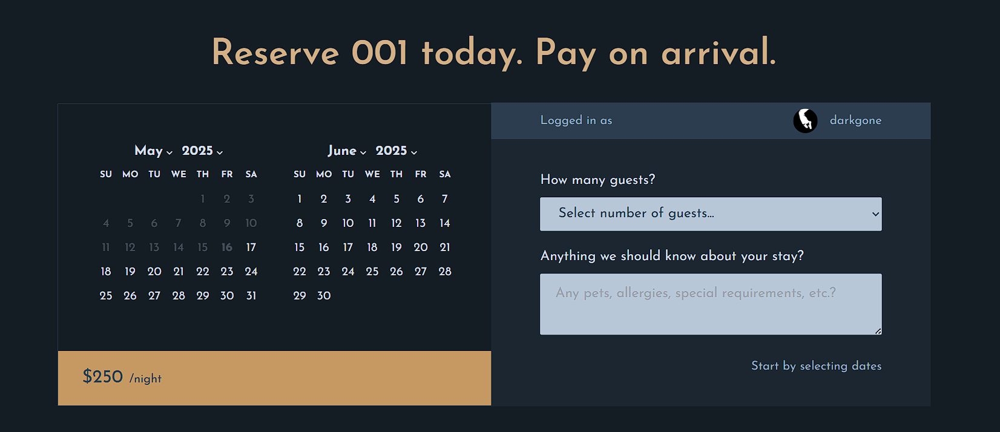
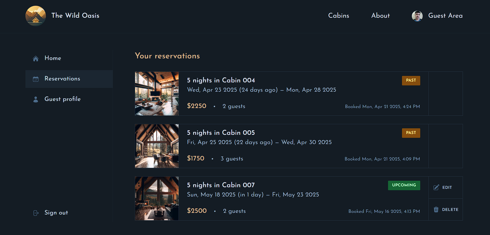
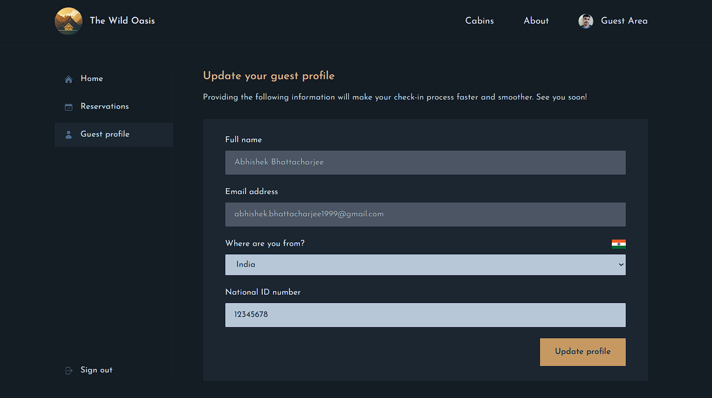

# The wild oasis website

The wild oasis is your paradise away from home. You can sign in and book from available cabins and spend a memorable time here.



## Features

### 1. Select from available cabins

Filter cabins based on number of guests.





### 2. Book a cabin



### 3. Manage bookings



### 4. Update profile



## Libraries Used

- [date-fns](https://date-fns.org/) : Modern JavaScript date utility library

- [tailwind css](https://tailwindcss.com/) : To design the web app.

- [next auth](https://next-auth.js.org/) : NextAuth.js is a complete open-source authentication solution for Next.js applications.

## Environment Variables

This project uses environment variables to manage sensitive information and configuration settings. The .env.local file contains variables for various services and credentials.

### Required Environment Variables

To set up the environment variables for this project, create a .env.local file in the root directory of your project and add the following variables:

```
NEXTAUTH_URL='http://localhost:3000'
NEXTAUTH_SECRET= your-nextauth-secret

AUTH_GOOGLE_ID= your-google-client-id
AUTH_GOOGLE_SECRET= your-google-client-secret

NEXT_PUBLIC_SUPABASE_URL= your-supabase-url
NEXT_PUBLIC_SUPABASE_KEY= your-supabase-anon-key
```
